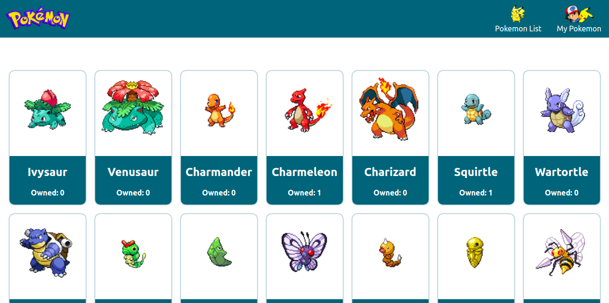
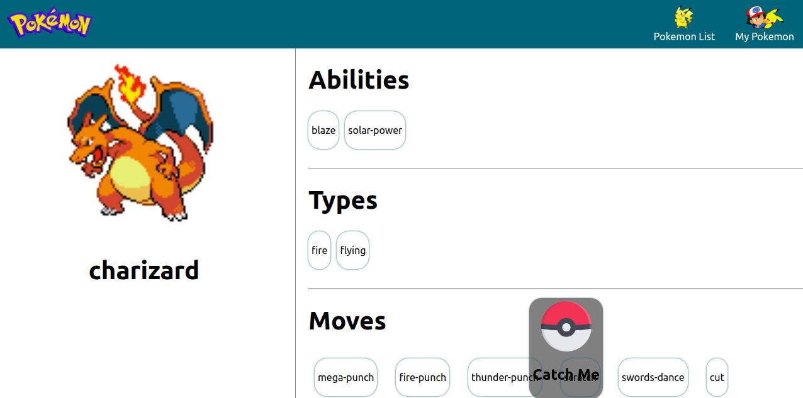
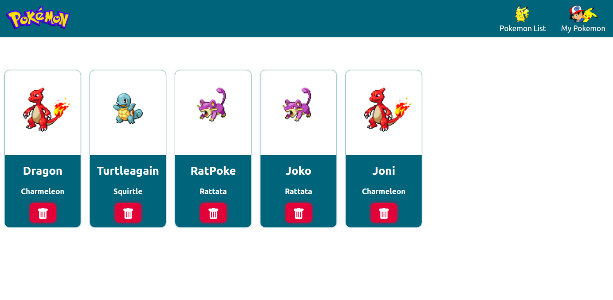
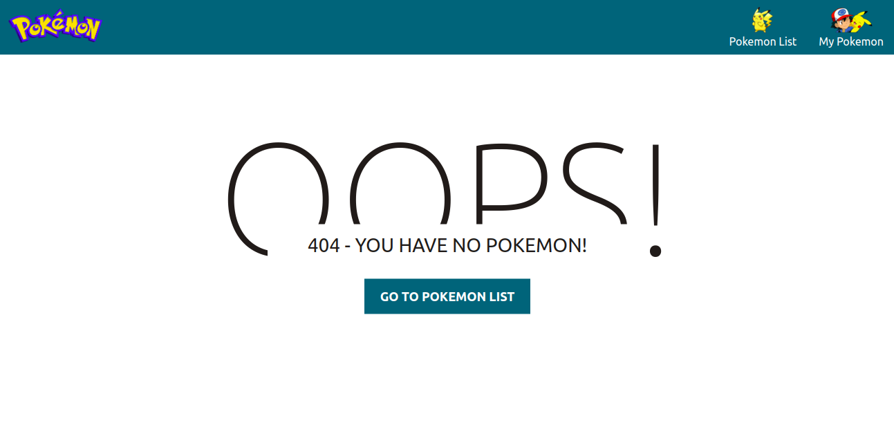

# pokemon

A Pokemon App.

<br>

Website:
<a href="https://pokemon-805d6.web.app/" >Go To Website</a >

This app has:

- Used Technology on Server Port 3000:

  - Programming Language : Node Js with Express
  - Database : Postgre SQL
  - ORM : Sequelize
  - TDD Test : Jest, Supertest

- Used Technology on Client:
  - Programming Language : React JS
  - Orchestrator : Graph QL - Apollo Client, React-redux
  - Styling : Emotion

## Pokemon Page

#### Main Page - Pokemon List


<br>

#### Pokemon Detail


<br>

#### My Pokemon


<br>

#### My Pokemon - if empty


<br>

## RESTful endpoints

### GET /

> Get all my pokemon

_URL_

```
http://localhost:3000/
```

_Request Header_

```
not needed
```

_Request Body_

```
not needed
```

_Response (200)_

```
{
    [
      {
          "id": 15,
          "name": "Dragon",
          "imageUrl": "https://raw.githubusercontent.com/PokeAPI/sprites/master/sprites/pokemon/6.png",
          "pokemonName": "charizard",
          "createdAt": "2021-01-17T16:14:27.535Z",
          "updatedAt": "2021-01-17T16:14:27.535Z"
      }
    ]
}

```

### POST /

> add new my pokemon

_URL_

```
http://localhost:3000/
```

_Request Header_

```
not needed
```

_Request Body_

```
{
    "name": "Laptop",
    "image_url": "https://d2pa5gi5n2e1an.cloudfront.net/global/images/product/laptops/ASUS_ROG_STRIX_Hero_II_/ASUS_ROG_STRIX_Hero_II__L_1.jpg",
    "price": 12000000,
    "stock": 2,
    "category": "elektronik",
}
```

_Response (201)_

```
{
    "id": 17,
    "name": "Sensei",
    "pokemonName": "ivysaur",
    "imageUrl": "https://raw.githubusercontent.com/PokeAPI/sprites/master/sprites/pokemon/2.png",
    "updatedAt": "2021-01-17T16:16:27.656Z",
    "createdAt": "2021-01-17T16:16:27.656Z"
}
```

_Response (400 - Bad Request)_

```
{
  "message": "name cannot empty, imageUrl cannot empty, pokemonName cannot empty,"This name has been registered"
}
```

### DELETE /:pokemon

> DELETE my pokemon.

_URL_

```
http://localhost:3000/:pokemon
```

_Request Body_

```
not needed
```

_Request Header_

```
not needed
```

_Response (200)_

```
{
    "message": "success delete"
}
```

_Response (404 - Not Found)_

```
{
  "message": "data not found"
}
```
